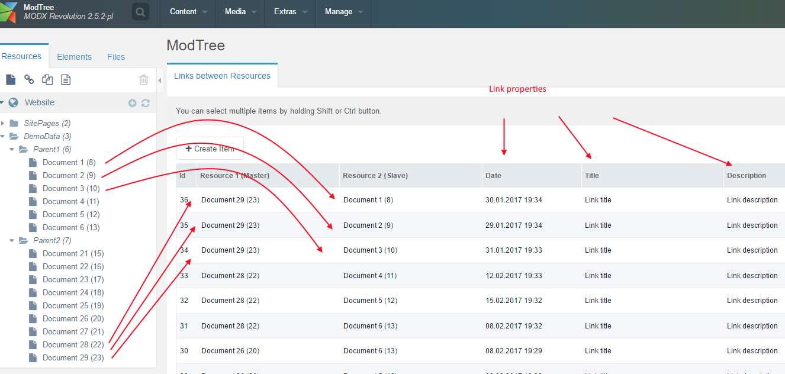
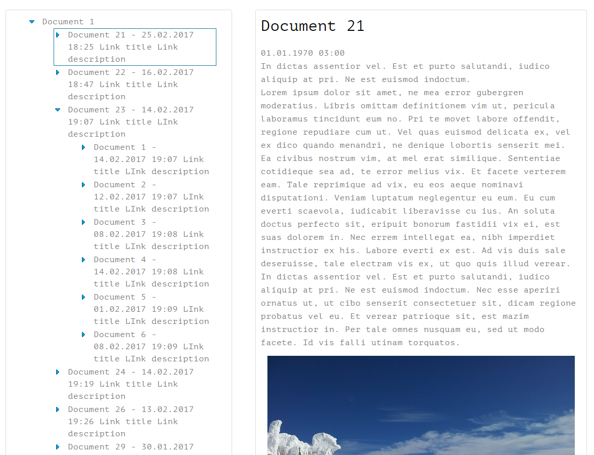

##ModTree

With this component, you can link resources of your site with each other and show them on page as a tree.

Make links between resources on admin custom manager page.



Start seach when the page loads:
>&queryLinks=`1` (default) - linked resources &parent (default current page),

>&queryLinks=`0` - child resources for &parent.

Then, when you click on the resources icons, searches for related resources of them.

When you click on resource the resource content is displayed.



See result on [live demo](http://modtree.visermort.ru/examples.html)

How to [install](http://modtree.visermort.ru/install.html)

Uses AJAX. JQuery not required.

### Examples:

#####Display child resources

&queryLinks=`0`. Display child resources of resource 7 on start search.

```
[[modTree?
    &parent=`7`
    &limitList=`5`
    &queryLinks=`0`
    ]]
```

#####Display linked resources

Display related resources of resource 15 on start search.

```
[[modTree?
    &parent=`15`
    &limitList=`5`
    ]]
```

###Snippet parameters

#####Result parameters

| Name                  | Default                     | Description                                                                                     |
| --------------------- | ------------------------------------------------- | ------------------------------------------------------------------------- |
| **&tplOuter**         | tpl.ModTree.outer           | Main template            |
| **&tplList**          | tpl.ModTree.itemList        | Template for start items |
| **&tplTree**          | tpl.ModTree.itemTree        | Template for childs branches on tree |
| **&tplSearchField**   | tpl.ModTree.itemSearchField | Template for search fields |
| **&tplButtons**       | tpl.ModTree.paginateBtns    | Template for paginate buttons |
| **&sortBy**           | menuindex                   |  |
| **&sortDir**          | ASC                         |  |
| **&limit**            | 0                           | Limit on tree for child branches |
| **&limitList**        | 15                          | Limit for start search  |
| **&contentIdPrefix**  | modtree-                    | Prefix of ID for content fields. In case using two or more snippet on page you must use other &tplOuter with other $contentIdPrefix. Fields can be placed anywhere on the page, even outside of the &tplOuter |
| **&customCss**        | 0                           | 1 - not linked component CSS. If you use your own styles you may disable component CSS |


#####Search parameters

| Name                  | Default                     | Description                                                                                     |
| --------------------- | ------------------------------------------------- | ------------------------------------------------------------------------- |
| **&queryLinks**       | 1                           | Determines the start search. `1` - related resources. `0` - child resources. If `0` - search fields are displayed as default |
| **&parent**           | curren resource             | Resource for start search |
| **&queryForce**       | 1                           | Determines whether to perform a start search. `1` - do start search, `0` - search only on search button click |
| **&linkWay**          | 0                           | Link direction. `1` - master to slave. `-1` - slave to master. `0` - both way |
| **&searchFields**     | padetitle,content           | Search fields. String with comma separator. To disable - &searchFields=``   |


